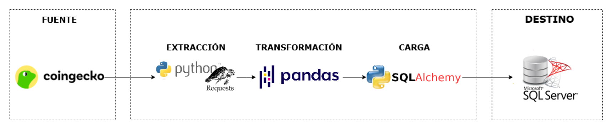
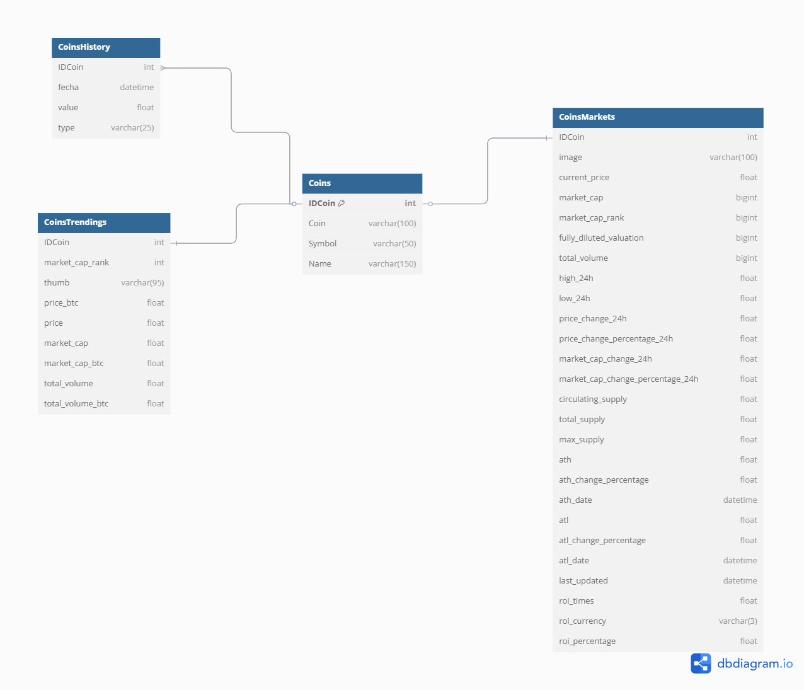
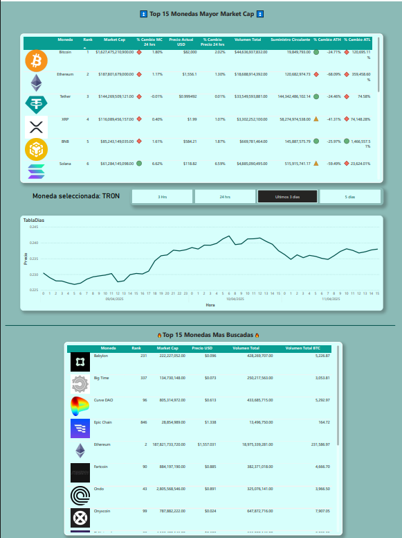

# Explicación del Data Pipeline

## Descripción General

---

## Extracción (Extract)

### Endpoints utilizados

| Endpoint | Descripción | Filtros Aplicados |
|----------|-------------|-------------------|
| `/coins/list` | Listado completo de monedas | - |
| `/coins/markets` | Precios y capitalización | `order=market_cap_desc&per_page=15` |
| `/search/trending` | Criptomonedas en tendencia | - |
| `/coins/{id}/market_chart` | Histórico de precios (1 día) | `vs_currency=usd&days=1` |

> Se puede importar la colección con el siguiente archivo:  
> [`Exploracion\CoinGecko.postman_collection.json`](Exploracion\CoinGecko.postman_collection.json) 
> También se puede hacer un fork de la colección con el siguiente botón: 
>

### Proceso

- Se realizan peticiones HTTP a los endpoints utilizando la librería `requests` en Python.
- Se aplican filtros para estandarizar y limitar la información, por ejemplo:
  - En `/coins/markets`, se ordena por capitalización de mercado y se toma el top 15.

---

## Transformación (Transform)

### Herramientas utilizadas
- `api_handler.py`
- [`APL-crypto.ipynb`](Exploracion/APL-crypto.ipynb)

### Proceso

- El proyecto fue modularizado para que cada transformación sea independiente, y las funciones puedan ser reutilizadas, incluyendo la conexión con la base de datos.
- Conversión de campos a tipos de datos adecuados (`float`, `datetime`, etc.):
  - **`/coins/markets`**: Conversión de fechas con `pd.to_datetime` y eliminación del `timezone` con `tz_localize` para insertar correctamente en SQL Server.
  - **`/search/trending`**: Limpieza de símbolos como `$` o `,`, y conversión a `float`.
  - **`/coins/{id}/market_chart`**: Conversión desde formato Unix (milisegundos) a `datetime`.
- Renombramiento de columnas cuando fue necesario.
- Limpieza de datos inconsistentes:
  - En columnas tipo arreglo, se eliminaron datos innecesarios directamente del JSON antes de normalizarlos.
  - Se usó `pd.json_normalize` para desanidar estructuras y estandarizar nombres de columnas (`.` → `_`).
- Validación:
  - Solo se cargan registros cuyo `IDCoin` ya exista en la tabla principal `Coins`, especialmente en `CoinsHistory` que contiene las monedas existentes en CoinsMarkets.

---

## Carga (Load)

### Destino
Base de datos relacional: **SQL Server**  

### Proceso

- **Mantenimiento de la tabla `Coins`**:
  - Se compara la lista actual con la respuesta del endpoint para eliminar monedas que ya no existen y agregar las nuevas.
  
- **Carga de las demás tablas**:

  1. Se ejecuta `TRUNCATE` sobre la tabla correspondiente.
  2. Se obtienen los datos desde el API utilizando las funciones en `api_handler.py`.
  3. Se utiliza `pd.merge` para vincular los datos con su `IdCoin` correspondiente.
  4. Se carga a SQL Server usando `df.to_sql` de `pandas` con `sqlalchemy`, usando `if_exists='append'`.

---
### Caso de Uso en Power BI

